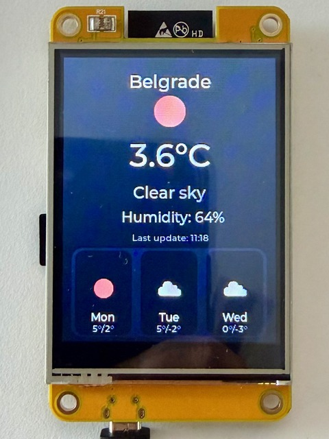

# ESP32 Weather Station

A beautiful weather display for ESP32 with 2.8" TFT LCD (240x320) using LVGL graphics library.


*ESP32 weather station showing real-time weather data for Belgrade*

## Features

- Real-time weather data from OpenWeatherMap
- Beautiful LVGL-based UI
- Displays:
  - Current temperature
  - Weather description
  - Humidity
  - City name
  - Last update time
- Auto-refresh every 15 minutes
- WiFi connection status

## Hardware Requirements

- ESP32 board with WiFi
- 2.8" ILI9341 TFT LCD display (240x320)
- USB cable for programming

## Software Requirements

- PlatformIO (VS Code extension recommended)
- OpenWeatherMap API key (free tier)

## Setup Instructions

### 1. Get OpenWeatherMap API Key

1. Go to [OpenWeatherMap](https://openweathermap.org/api)
2. Sign up for a free account
3. Navigate to API Keys section
4. Copy your API key

### 2. Configure the Project

Edit `include/config.h` and update:

```cpp
#define WIFI_SSID "YOUR_WIFI_SSID"           // Your WiFi network name
#define WIFI_PASSWORD "YOUR_WIFI_PASSWORD"   // Your WiFi password
#define WEATHER_API_KEY "YOUR_API_KEY"       // Your OpenWeatherMap API key
#define WEATHER_CITY "New York"              // Your city name
#define WEATHER_COUNTRY_CODE "US"            // Your country code
```

### 3. Install PlatformIO

If you haven't already:
1. Install [Visual Studio Code](https://code.visualstudio.com/)
2. Install the PlatformIO IDE extension
3. Restart VS Code

### 4. Build and Upload

1. Open this project folder in VS Code
2. PlatformIO will automatically install dependencies
3. Connect your ESP32 board via USB
4. Click the "Upload" button (→) in the PlatformIO toolbar
   - Or use: `pio run --target upload`

### 5. Monitor Serial Output

Click the "Serial Monitor" button in PlatformIO to see debug output:
- WiFi connection status
- Weather data updates
- Any errors

## Pin Configuration

The default pin configuration in `platformio.ini`:

```
TFT_MISO = 12
TFT_MOSI = 13
TFT_SCLK = 14
TFT_CS   = 15
TFT_DC   = 2
TFT_RST  = 4
TOUCH_CS = 33
```

If your board uses different pins, update the `build_flags` section in `platformio.ini`.

### Touchscreen & Brightness Control

This project targets the ESP32-2432S028 series 2.8" ILI9341 display that exposes an XPT2046 touch controller on the HSPI bus. Besides `TOUCH_CS`, the following pins are defined in `platformio.ini` and can be adjusted for other hardware:

```
TOUCH_MOSI = 32
TOUCH_MISO = 39
TOUCH_CLK  = 25
TOUCH_IRQ  = 36
```

The touch panel is calibrated in `src/main.cpp` through the `TOUCH_RAW_MIN_*`, `TOUCH_RAW_MAX_*`, `TOUCH_SWAP_XY`, and `TOUCH_INVERT_*` constants. Modify those values if taps appear mirrored or offset on your device.

Every tap on the screen cycles the TFT backlight between 33 %, 60 %, and 100 %. The default level on boot is 60 %, and the percentages/PWM steps live in `BRIGHTNESS_LEVELS`/`BRIGHTNESS_PERCENT`. Adjust those arrays if you prefer different steps.

## Customization

### Update Interval

Change the refresh rate in `include/config.h`:
```cpp
#define UPDATE_INTERVAL 900000  // milliseconds (15 minutes default)
```

### Display Colors

Modify colors in `src/main.cpp` using hex values:
```cpp
lv_obj_set_style_bg_color(scr, lv_color_hex(0x1E1E1E), 0);  // Background
lv_obj_set_style_bg_color(title_bar, lv_color_hex(0x2196F3), 0);  // Title bar
```

### Temperature Units

To use Fahrenheit instead of Celsius, edit `include/config.h`:
```cpp
#define WEATHER_CURRENT_API_URL "/data/2.5/weather?q=" WEATHER_CITY "," WEATHER_COUNTRY_CODE "&units=imperial&appid=" WEATHER_API_KEY
#define WEATHER_FORECAST_API_URL "/data/2.5/forecast?q=" WEATHER_CITY "," WEATHER_COUNTRY_CODE "&units=imperial&appid=" WEATHER_API_KEY
```

Then update the display format in `src/main.cpp`:
```cpp
sprintf(temp_str, "%.1f°F", weather.temperature);
```

## Troubleshooting

### Display shows nothing
- Check pin connections match your board
- Verify TFT_eSPI pin definitions in `platformio.ini`
- Try adjusting `TFT_MISO`, `TFT_MOSI`, `TFT_SCLK`, `TFT_CS`, `TFT_DC`, `TFT_RST` values

### WiFi connection fails
- Verify SSID and password in `config.h`
- Check WiFi signal strength
- Ensure 2.4GHz WiFi (ESP32 doesn't support 5GHz)

### Weather data not updating
- Verify API key is correct
- Check city name and country code
- Free tier has 60 calls/min limit
- Monitor serial output for error messages

### "API Error" message
- Wait a few minutes (new API keys can take time to activate)
- Verify internet connection
- Check API key hasn't expired

## Project Structure

```
esp32-weather-station/
├── include/
│   └── config.h          # WiFi and API configuration
├── src/
│   ├── lv_conf.h         # LVGL configuration
│   └── main.cpp          # Main application code
├── platformio.ini        # PlatformIO configuration
└── README.md            # This file
```

## Dependencies

Automatically installed by PlatformIO:
- LVGL 8.3.11 (Graphics library)
- TFT_eSPI 2.5.43 (Display driver)
- ArduinoJson 6.21.3 (JSON parsing)

## License

Free to use and modify for personal and commercial projects.

## Credits

- Weather data: [OpenWeatherMap](https://openweathermap.org/)
- Graphics library: [LVGL](https://lvgl.io/)
- Display driver: [TFT_eSPI](https://github.com/Bodmer/TFT_eSPI)
